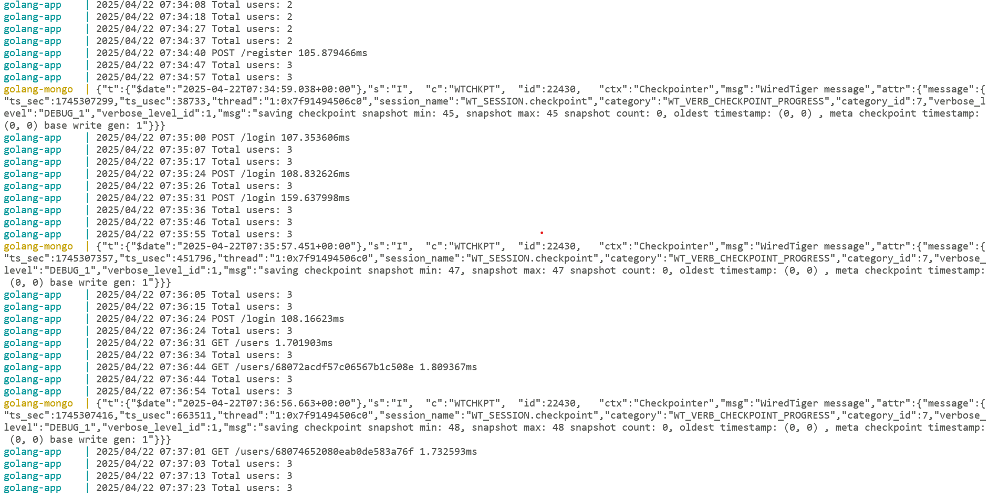

# Golang Rest Project

Build a simple RESTful API in Golang to manage users by using MongoDB, JWT authentication, and Docker compose V2.

## Project Checklist Included

* ✅ RESTful API with CRUD
* ✅ User Model
* ✅ Prevent register duplicate email
* ✅ JWT Authentication using HMAC (HS256)
* ✅ MongoDB Integration
* ✅ Middleware Protection
* ✅ Concurrency Task with a background routine every 10 seconds
* ✅ Testing with MongoDB UserInterface
* ✅ Deployment with Docker, Docker Compose (V2) for API and MongoDB
* ✅ Added validation for the required fileds e.g. email and password for /login.
* ✅ Implement graceful shutdown
* ✅ Use Hexagonal Architecture
* ✅ gRPC—example
    * Created file: `proto/user.proto`
    * Generate file: `proto/userpb/user.pb.go`
    * Generate file: `proto/userpb/user_grpc.pb.go`

## Pre-requisition

* Use Docker the latest version and Docker Compose V2
* Docker version 26.1.3
* Docker Compose version v2.27.1

## Getting started

* Contact Khachornchit to config parameter
* Git clone project into your computer `git clone https://github.com/khachornchit/golang-rest`
* Run cmd `cd golang-rest/deployments`
* Run cmd `docker compose up --build`
* The project will run two services in the Docker compose as following.
    * `golang-mongo` port 7001
    * `golang-app` port 7002

## Example of the golang-service running at Docker Compose



## Sample API request/response

* Suggest using Postman for API testing as the following sample API request/response
* Endpoint URL of golang-app : http://localhost:7002

## POST /register


## POST /login


## GET /users

* Select the `Authorization` tab in the Postman
* Choose Auth Type as `Bearer Token`
* Copy the token from the POST /login for the Token value
* Click Send
  

## GET /users/{id}

* Use the id from the response data of GET /users
* Choose the Auth Type `Bearer Token` and using the same Token value
  

## PUT /users/{id}

* Use the id from the response data of GET /users
* Choose the Auth Type `Bearer Token` and using the same Token value
  

## DELETE /users/{id}

* Use the id from the response data of GET /users
* Choose the Auth Type `Bearer Token` and using the same Token value
  

## Testing

* Testing by goto the root project `golang-rest`
* Run command `golang-rest> go test -count=1 -v .\tests\`
  

## Example Request Data

### POST /register

Example request data for POST /register, see example result in Postman above.

```register
{
    "name": "user1",
    "email": "user1@example.com",
    "password": "user1pw"
}
```

### POST /login

Example request data for POST /login, see example result in Postman above.

```login
{
    "email": "user1@example.com",
    "password": "user1pw"
} 
```

### PUT /users/{id}

Example request data for PUT /users/{id}, see an example result in Postman above.

```users/{id}
{
    "email": "user1y@example.com",
    "name": "user1y"
}
```